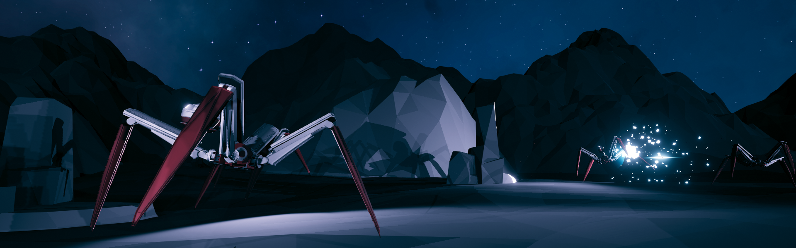

## Angry AI - [Video](https://youtu.be/krzmg9eOeDM)

This is a little robot battle simulation, made with [Unity Machine Learning Agents](https://github.com/Unity-Technologies/ml-agents) [v0.12](https://github.com/Unity-Technologies/ml-agents/releases/tag/0.12.0).  

Each bot is controlled by two reinforcement learning agents which were trained in tandem with PPO . 

The upper-tier agent ("fighter") observes the bot's vicinity with raycasts, collecting information about the types of objects, their relative distances and movements. Additionally, the bot's own velocity, its head position and body inclination are observed. The model output controls gun fire action and the bot's head for more precise aiming. It also provides walking directions and a walk mode for the lower-tier model. In order to train the bot for combat, rewards are assigned for locking on to a target and for movement speed (proportional to walked distance over ten time steps). It receives penalties if it comes too close to obstacles, falls over, or if it gets hit by an opponent bullet. Wasting ammunition and deciding not to fire while locking on to a target are penalized as well.

The lower-tier agent ("walker") also observes the bot's movement and body inclination, in addition to its leg positions and relative velocities of the feet. Ground distances are measured for each foot and the body center. It receives walking directions from the "fighter" agent - a normalized angle, relative to the bot's current heading on the XZ plane. The walk mode can have one of three values: forward, backward or pause. Model outputs control the legs' joint angles. For training it to walk, rewards are set in proportion to the bot's velocity towards the target direction and for facing that direction.

The project contains a few prefabs taken from freely available assets:  
https://assetstore.unity.com/packages/3d/environments/landscapes/lowpoly-environment-pack-99479  
https://assetstore.unity.com/packages/3d/environments/landscapes/polydesert-107196

Gun Bot design by Dennis Haupt.  
https://3dhaupt.com/3d-model-my-gunbot-design-download/

Dependencies:  
https://github.com/Unity-Technologies/ml-agents/releases/tag/0.12.0
