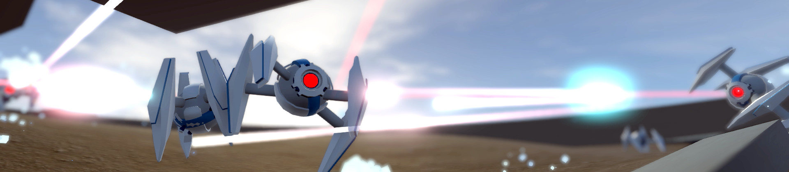

## Angry AI - [Video](https://youtu.be/xXTy9xsu25g)

This is a little robot battle simulation, made with [Unity Machine Learning Agents](https://github.com/Unity-Technologies/ml-agents).  

The motivation for this project was to experiment with using the [camera's depth texture](https://docs.unity3d.com/Manual/SL-CameraDepthTexture.html) as visual input for reinforcement learning. I also wanted to create a quadruped agent with a rather small action/observation space, compared to the [Crawler](https://www.youtube.com/watch?v=ftLliaeooYI) included in the ml-agents examples. 

The project utilizes the now [outdated version 0.5 of ml-agents](https://github.com/Unity-Technologies/ml-agents/releases/tag/0.5.0a). Please note that [Agent.cs](https://github.com/mbaske/angry-ai/blob/master/UnityEnv/Assets/ML-Agents/Scripts/Agent.cs) was changed to allow for a custom texture replacing the camera feed.\
In order to run the trained models, you need to install the Unity TensorFlowSharp Plugin and add ENABLE_TENSORFLOW to Edit > Project Settings > Player > Configuration > Scripting Define Symbols in the Unity Editor.
An archived copy of the plugin is available [here](https://www.icloud.com/iclouddrive/0hz4Gx3Knz6D6iuU8fqcasIaw#TFSharpPlugin).

Robot design by Lacomap (modified) via [free3d.com](https://free3d.com/user/lacomap)